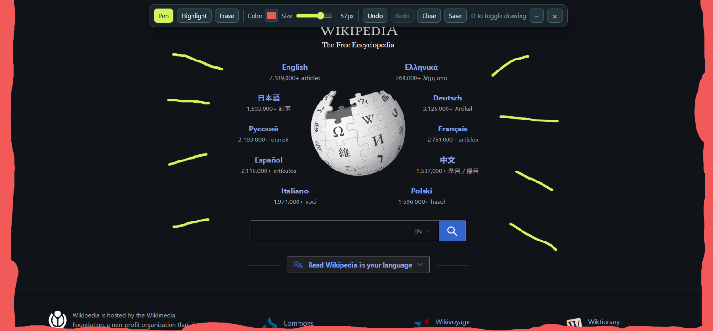

# Draw Everywhere

Draw directly on top of any website with a lightweight, self-contained bookmarklet.

## How to use

1. Open or create a bookmark in your browser.
2. Set its URL to the contents of [`minified.js`](minified.js).
3. Visit any website and click the bookmark!

Don't have a browser that can run bookmarklets? Open DevTools on a page, paste the file contents into the console, and run it.

## Features

- Pen, highlighter, and eraser tools
- Adjustable color and stroke size
- Undo and redo history
- Clear canvas button
- Minimize the toolbar or toggle drawing with `D`
- Keyboard shortcuts: `P` pen, `H` highlighter, `E` eraser, `Esc` close